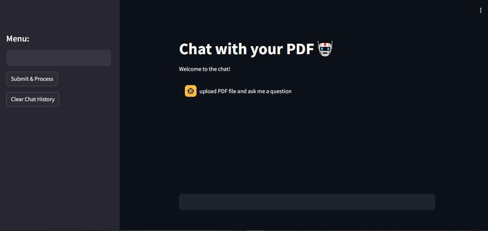

# 🧠 ChatWithPDF

**ChatWithPDF** is a Streamlit-based web app that allows users to upload PDF files and ask questions about their content using powerful language models. It's ideal for quickly summarizing, exploring, or understanding large PDF documents.

---

## 🚀 Features

- 📄 Upload and read PDF files
- 🤖 Ask questions about the content
- 🔍 Get AI-powered answers using Google Gemini API
- 🌐 Intuitive UI built with Streamlit

---

## 📸 Screenshot

> 📌 *Replace the image below with your actual screenshot.*



---

## 📁 Project Structure
ChatWithPDF/
├── app.py
├── requirements.txt
├── .env
├── README.md
└── pdf/ # Folder for uploaded PDFs
---

---

## 🛠️ Installation & Setup

### 1. Clone the Repository

```bash
git clone https://github.com/your-username/ChatWithPDF.git
cd ChatWithPDF
```
### 2. Create and Activate Virtual Environment
```
conda create --name venv python=3.11
conda activate venv
python3 -m venv venv
source venv/bin/activate  # On Windows: venv\Scripts\activate
```

### 3. Install Dependencies
```
pip install -r requirements.txt
```
### 4. Environment Variables
Create a .env file in the root directory and add the following:
```
GEMINI_API_KEY=your_gemini_api_key_here
```

## Run the App
```
streamlit run app.py
```


